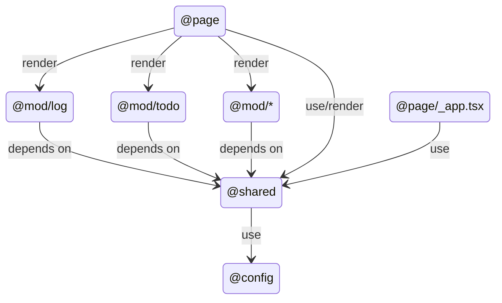

This is a starter template for [Next.js](https://nextjs.org) with modular structure and strict dependencies.

## Features

- NestJS-like Modular structure
- Strict dependencies

## Getting Started

First, run the development server:

```bash
npm run dev
```

Open [http://localhost:3000](http://localhost:3000) with your browser to see the result.

## Module dependencies



## Folder structure

```
public/       # static files which serve by public url
src/
├── assets/   # satic files which directly import in code
├── config/   # config, constants, environment variables...
├── modules/  # app logic separated by modules
│             # each module is a boundary context
├── pages/    # next.js file-based routing system
└── shared/   # shared code which used across modules
              # 1. shared components, lib, hooks...
              # 2. shared state: redux, zustand, context...
              # 3. infrastructure implementation

```

### Module structure

```
src/mods/todo
├── components		# React component which only for Todo use cases
│   ├── AddTodoForm.tsx
│   ├── TodoList.tsx
│   ├── TodoItem.tsx
│   └── (...)
├── domain			# Define interface/services of Todo business logic
│   ├── dto
│   │   ├── todo.entity.ts
│   │   ├── search-todos.payload.ts
│   │   ├── create-todo.payload.ts
│   │   └── update-todo.payload.ts
│   ├── todo.repository.ts
│   └── todo.service.ts
├── impl			# implementation of repository, use adapter pattern
│	│				# can extends usage to: axios, socket.io, graphql...
│   └── todo.repository.impl.ts 
```

## Other configuration

`tsconfig.json`
```jsonc
{
  "compilerOptions": {
    // other config
    "paths": {
      "@mod/*": ["./src/modules/*"],
      "@page/*": ["./src/pages/*"],
      "@shared/*": ["./src/shared/*"],
      "@assets/*": ["./src/assets/*"],
      "@config/*": ["./src/config/*"],
    }
  }
}
```

Strictly import using `eslint-plugin-strict-dependencies`

`.eslintrc`
```jsonc
{
  // ...other config
  "plugins": ["strict-dependencies"],
  "rules": {
    // ...other rules
    "strict-dependencies/strict-dependencies": [
      "error",
      [
        {
          "module": "@config",
          "allowReferenceFrom": ["src/shared"],
          "allowSameModule": true
        },
        {
          "module": "@shared",
          "allowReferenceFrom": ["src/modules", "src/pages", "src/shared"],
          "allowSameModule": true
        },
        {
          "module": "@mod",
          "allowReferenceFrom": ["src/pages"]
        },
        {
          "module": "@page",
          "allowReferenceFrom": [],
          "allowSameModule": true
        }
      ]
    ]
  }
}
```
